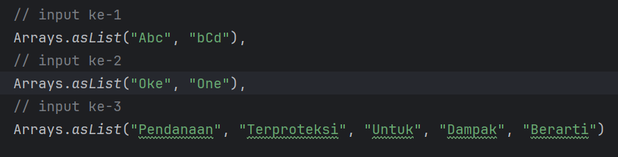

# Aplikasi Penyortiran Frekuensi Huruf

## Deskripsi 
Membuat fungsi untuk mengelompokan setiap huruf (besar kecil berpengaruh)
dan mengurutkan huruf dari jumlah yang terbanyak hingga paling sedikit.
jika jumlah sama, maka urutan ditentukan oleh huruf besar terlebih dahulu, diikuti oleh
susunan abjad a-z menggunakan bahasa pemrograman java.

## Run Main Class
SortApplication.java

#### Input :

#### Output :

